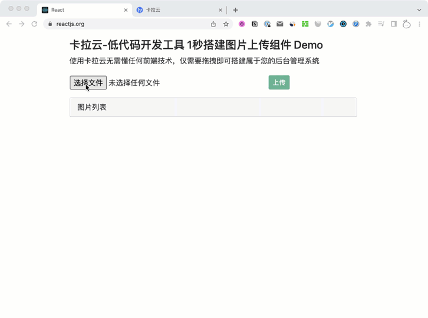

# 全栈实战：React + Nodejs 搭建带预览的「上传图片/预览」管理后台

本教程配套文章请访问卡拉云技术博客：《[全栈实战：React + Nodejs 搭建带预览的「上传图片/预览」管理后台）](https://kalacloud.com/blog/react-upload-image-axios/)》

手把手教你开发带预览的 React 图片上传组件，即图片上传管理后台。只要你跟本教程一步一步走，最终能很好的理解整个前后端传图的工程逻辑。前端我们使用 React + Axios + Multipart 来搭建前端上传图片应用，后端我们使用 Node.js + Express + Multer 来搭建后端上传图片的后端处理。

本教程还会教给大家如何写一个可限制上传图片大小，有进度条，可报错，可显示图片列表，可下载已上传图片的图片管理后台。

最后完成的上传图片工具后台如下图，跟随本教学习，你也可以搭出来。

